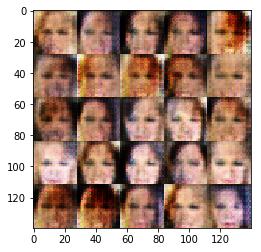
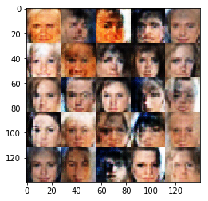
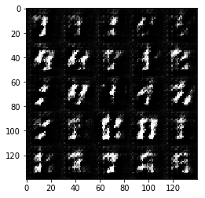
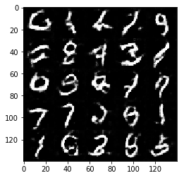

# Face Generation DCGAN

Using deep learning DCGAN neural network to generate realistic faces from celebrity images.

# Overview

Using a Deep Convolutional Generative Adversarial Network (DCGAN) to generates new images of faces. The dataset that's used is the [CelebFaces Atrribute Dataset (CelebA)](http://mmlab.ie.cuhk.edu.hk/projects/CelebA.html), which contains over 200,000 celebrity faces with annotations.

Tensorflow implementation of [Deep Convolutional Generative Adversarial Networks](http://arxiv.org/abs/1511.06434) which is a stabilize Generative Adversarial Networks. 

### Files

[Jupyter Notebook](https://github.com/hparik11/face-generation/blob/master/face_generation.ipynb)

### Hyperparameters

Hyperparameter          | Number |
----------------------- | ------ |
Epochs                  | 1      |
Batch size              | 128     |
Learning rate           | 0.0005 |
Z dimension             | 100    |
Beta 1                  | 0.5    |

## Results

### celebA

After 10 iterations:

After 20 iterations:

### MNIST

After 10 iterations:

After 20 iterations:

## Related works

- [DCGAN-tensorflow](https://github.com/carpedm20/DCGAN-tensorflow)
- [DiscoGAN-pytorch](https://github.com/carpedm20/DiscoGAN-pytorch)
- [simulated-unsupervised-tensorflow](https://github.com/carpedm20/simulated-unsupervised-tensorflow)

